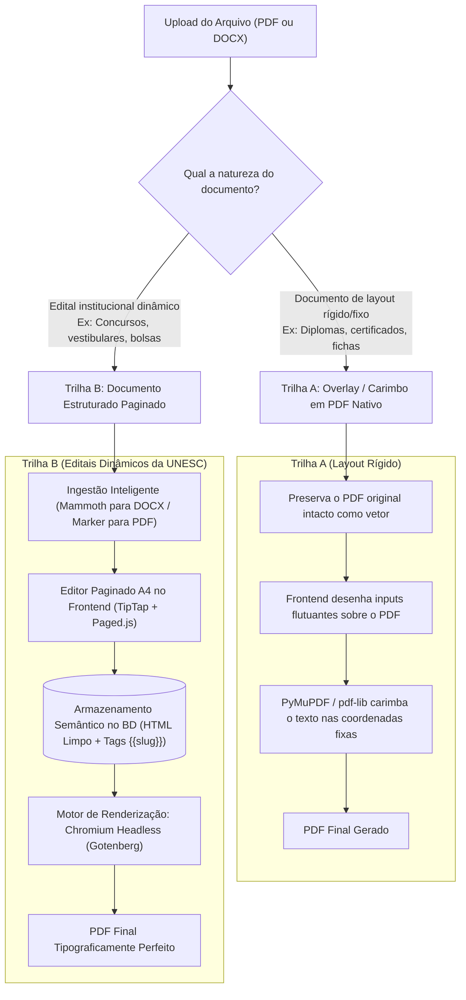

# Análise da Solução Definitiva para Resolução dos Problemas dos Editais (UNESC)

## Arquitetura de Duas Trilhas com Documento Estruturado Paginado (TipTap + Gotenberg/Chromium Headless)

---

## 1. Contexto e Objetivo

Este documento apresenta uma análise técnica aprofundada, conceitual e arquitetural da **Solução Definitiva** para o sistema de importação, edição, pré-visualização e geração de editais da Universidade do Extremo Sul Catarinense (UNESC).

A partir de todo o histórico de dificuldades enfrentadas pelo projeto — que inclui sobreposição de texto, cabeçalhos/rodapés deslocados, quebra de tabelas, fragmentação de tags dinâmicas, rigidez de coordenadas absolutas e limitações dos motores clássicos de PDF —, esta proposta define como resolver o problema **pela raiz**, sem amarras de legado ou restrições artificiais de linguagens.

### Regra Desta Etapa:
> **NÃO IMPLEMENTAR NENHUM CÓDIGO NESTA FASE.**
> Nenhum arquivo do sistema de produção deve ser alterado, nenhuma dependência instalada e nenhuma migração executada antes da avaliação e aprovação integral deste documento.

---

## 2. A Causa Raiz Histórica de Todos os Problemas

A engenharia de documentos digitais estabelece uma distinção fundamental que explica todos os problemas ocorridos até hoje:

```
┌──────────────────────────────────────────────┐
│           FORMATO PDF (Saída Fixa)           │
├──────────────────────────────────────────────┤
│ • Criado em 1993 como "papel digital".      │
│ • Não possui parágrafos, fluxos nem tabelas. │
│ • Desenha caracteres em coordenadas (X, Y).  │
│ • Feito para IMPRESSÃO, não para EDIÇÃO.     │
└──────────────────────────────────────────────┘
                      ▲
                      │  Tentativa de "desmontar" gera perda de dados e sobreposição
                      ▼
┌──────────────────────────────────────────────┐
│       DOCUMENTO EDITÁVEL (Fluxo Contínuo)     │
├──────────────────────────────────────────────┤
│ • Modelo baseado em Árvore Semântica (DOM).  │
│ • Parágrafos, cabeçalhos, tabelas reais.     │
│ • Textos longos empurram o conteúdo abaixo.  │
│ • Páginas são geradas dinamicamente.         │
└──────────────────────────────────────────────┘
```

1. **A armadilha do `pdf2htmlEX`**: O `pdf2htmlEX` gerava milhares de tags `<div>` com `position: absolute; left: Xpx; top: Ypx;`. Quando qualquer usuário digitava um texto maior do que o original ou preenchia uma tag `{{slug}}`, o texto novo colidia e sobrepunha o texto que estava na coordenada logo abaixo.
2. **A armadilha do PDF $\to$ DOCX cego**: Conversores de PDF para DOCX automáticos costumam isolar elementos em "caixas de texto flutuantes" (`<w:txbxContent>`) para não perder o visual, reproduzindo a mesma rigidez de coordenadas e quebrando as tags `{{slug}}` em múltiplos fragmentos XML (`<w:r>`).
3. **A limitação de motores PHP legados (mPDF / FPDF)**: Motores clássicos em PHP possuem interpretadores de HTML/CSS próprios, incompletos e defasados. Eles não suportam Flexbox moderno, quebras de página dinâmicas baseadas em especificações recentes de CSS Paged Media e quebram frequentemente ao renderizar tabelas complexas.

---

## 3. A Solução Definitiva: O Paradigma de Duas Trilhas (*Two-Track Architecture*)

Para que o sistema suporte tanto **documentos de formulário fixo** quanto **editais institucionais complexos**, a arquitetura precisa separar a ingestão em duas trilhas com propósitos bem definidos:



---

## 4. Detalhamento dos Componentes da Trilha Principal (Editais Dinâmicos)

### 4.1. Camada de Ingestão e Conversão Inteligente

- **Se o modelo for DOCX**:
  O DOCX já é um documento semântico de fluxo contínuo. Ele é convertido diretamente para o HTML limpo do editor em menos de 100 milissegundos utilizando a biblioteca **Mammoth** (no backend ou via microserviço Node/Python).
  - Preserva parágrafos, cabeçalhos, negritos, itálicos e tabelas reais.
  - Ignora estilos visuais poluídos do Word e gera HTML semântico puro.

- **Se o modelo for PDF Legado**:
  Utiliza-se um microserviço de **Extração Baseada em Layout Semântico** (utilizando a biblioteca open source de visão documental **Marker** ou heurística PyMuPDF espacial):
  - O extrator identifica estruturalmente o que é **Cabeçalho Institucional**, o que é **Corpo do Documento** e o que é **Rodapé/Paginação**.
  - Reconhece tabelas e as converte em `<table>`, `<thead>` e `<tbody>` válidos.
  - O resultado entregue ao editor é um documento de fluxo contínuo, **sem nenhuma coordenada absoluta em pixels**.

---

### 4.2. Camada de Edição: Editor Paginado em Folhas A4 (TipTap / ProseMirror + Paged Media)

No frontend React, em vez de exibir um canvas fixo com imagens sobrepostas, o usuário interage com um editor com a experiência visual do **Google Docs** ou **Word Online**:

1. **Visualização em Folhas A4 Reais**:
   O editor divide o texto visualmente em páginas brancas A4 (com sombras e margens institucionais de 2,5 cm).
2. **Cabeçalho e Rodapé Blindados**:
   O cabeçalho (com o brasão da UNESC) e o rodapé institucional ficam posicionados nas áreas reservadas da página. O usuário não corre o risco de arrastar ou desalinhar esses elementos acidentalmente.
3. **Tags Dinâmicas como Nós Semânticos (Mention/Tag Extension)**:
   As variáveis `{{nome_reitor}}`, `{{valor_bolsa}}` e `{{data_abertura}}` não são texto comum que o usuário pode quebrar sem querer. Elas são renderizadas como **"pílulas" interativas (badges)**:
   - Se o usuário quiser inserir uma tag, ele digita `/` ou clica na barra lateral e seleciona o campo desejado.
   - O editor garante que a tag permaneça íntegra no banco de dados.
4. **Quebra Automática de Página (Pagination Virtual)**:
   Conforme o usuário digita ou cola um texto extenso, o editor cria a Página 2, Página 3, etc., empurrando os parágrafos de forma fluida.

---

### 4.3. Camada de Renderização do PDF Final: Chromium Headless (Gotenberg Engine)

O maior salto de qualidade e estabilidade consiste em substituir bibliotecas de renderização PHP antigas (como mPDF) por uma engine moderna baseada no motor do Google Chrome: **Gotenberg** (Docker).

#### Por que o Chromium Headless via Gotenberg é superior?
1. **Suporte Total ao CSS Moderno**: Suporta Flexbox, CSS Grid, tipografia web (`font-feature-settings`), SVG nativo e Tailwind CSS v4.
2. **Padrão W3C CSS Paged Media (`@page`)**:
   Permite definir cabeçalhos e rodapés institucionais diretamente nas regras de impressão do navegador:
   ```css
   @page {
       size: A4 portrait;
       margin-top: 30mm;
       margin-bottom: 25mm;
       margin-left: 20mm;
       margin-right: 20mm;

       @top-center {
           content: element(header-unesc);
       }
       @bottom-center {
           content: "Página " counter(page) " de " counter(pages);
           font-size: 9pt;
           color: #666;
       }
   }
   ```
3. **Quebra Inteligente de Tabelas**:
   Se uma tabela de vagas ou cronograma tiver 40 linhas e ultrapassar a folha:
   - O Chromium quebra a tabela no ponto exato da linha (`page-break-inside: avoid`);
   - Repete automaticamente o cabeçalho da tabela (`<thead>`) no topo da página seguinte.
4. **Isolamento e Desempenho**:
   O Gotenberg roda em um contêiner Docker leve, consome requisições HTTP REST do Laravel (`POST /forms/chromium/convert/html`) e entrega o PDF binário em alta velocidade com concorrência gerenciada.

---

### 4.4. Camada de Negócio e Persistência: Laravel 13

O Laravel permanece como o cérebro da aplicação, aproveitando todo o ecossistema robusto já construído:
- Autenticação e controle de perfis/papéis via Fortify e Spatie Permission.
- Gestão dos modelos de documentos e seus metadados no banco PostgreSQL.
- Armazenamento do conteúdo do modelo em formato **HTML Semântico A4**.
- Orquestração da mesclagem de dados (substituição das tags `{{slug}}` pelos valores preenchidos pelo usuário).
- Envio da requisição de compilação para o Gotenberg e entrega do download seguro ao usuário.

---

## 5. Como os 13 Problemas Históricos São Resolvidos Definitivamente

| # | Problema Enfrentado no Sistema | Solução Definitiva com a Nova Arquitetura |
| :-: | :--- | :--- |
| **1** | **Duplicidade e sobreposição de textos** | **Extinto.** O modelo não possui posições fixas (`left`/`top` em pixels). Todo o texto obedece ao fluxo contínuo do DOM; textos novos empurram os anteriores sem colisão. |
| **2** | **Cabeçalho e rodapé invertidos ou no topo** | **Resolvido na raiz.** Cabeçalhos e rodapés são governados pelas margens da regra CSS `@page` do navegador, desvinculados do stream bruto do corpo. |
| **3** | **Textos longos estourando a folha** | **Resolvido por design.** O motor Chromium calcula a altura dos elementos e cria novas páginas A4 automaticamente conforme o volume de texto. |
| **4** | **Tabelas desconfiguradas e linhas soltas** | **Resolvido.** Tabelas são representadas como elementos `<table>` reais com repetição automática de `<thead>` entre páginas. |
| **5** | **Cabeçalho e rodapé colados ou como páginas separadas** | **Resolvido.** A folha A4 tem altura e margens fixas padronizadas, com a área do corpo crescendo flexivelmente no centro. |
| **6** | **Dependência de binários obsoletos (`pdf2htmlEX`)** | **Eliminado.** Zero dependência de binários legados. Uso de padrões modernos web (Chromium e TipTap). |
| **7** | **Instabilidade e quebras por formato de PDF** | **Mitigado por desacoplamento.** O PDF é gerado a partir de código web padronizado (HTML/CSS), eliminando a fragilidade de parses binários. |
| **8** | **Lentidão no processamento de PDFs pesados** | **Resolvido.** O Chromium renderiza páginas com aceleração de pipeline gráfico moderno, gerando documentos em milissegundos. |
| **9** | **Pré-visualização dessincronizada com o PDF final** | **100% de paridade visual (WYSIWYG).** Como o preview no React e o renderizador final (Chromium) utilizam o mesmo motor de layout CSS, o que o usuário vê na tela é idêntico ao PDF impresso. |
| **10** | **Quebra e corrupção das tags `{{slug}}`** | **Protegido por nós atômicos.** No editor TipTap, as tags são tratadas como entidades únicas e indivisíveis (*inline atom nodes*). |
| **11** | **Incompatibilidade de fontes e visual quebrado** | **Padronização institucional.** Uso de fontes web abertas e institucionais da UNESC (`Inter`, `Aptos`, `Calibri`) embutidas diretamente via CSS `@font-face`. |
| **12** | **Paginação inconsistente ou perdida** | **Nativo pelo CSS.** Utilização de contadores automáticos do navegador (`counter(page)` e `counter(pages)`), imunes a erros de numeração manual. |
| **13** | **Limitações e falhas do mPDF** | **Superado.** A substituição do mPDF pelo Chromium elimina 100% das limitações de suporte a CSS, sombras, bordas e alinhamentos. |

---

## 6. Matriz Comparativa entre as Abordagens

| Critério de Avaliação | Abordagem Antiga (`pdf2htmlEX` + mPDF) | Abordagem Intermediária (Python PyMuPDF + mPDF) | Solução Definitiva (TipTap + Gotenberg / Chromium) |
| :--- | :---: | :---: | :---: |
| **Fidelidade da Pré-visualização** | Baixa (quebrava e desalinhava) | Média (separação visual de blocos) | **Perfeita (WYSIWYG real de navegador)** |
| **Tolerância a Textos Longos** | Nula (sobreposição imediata) | Média (dependia de quebras manuais) | **Total (quebra automática de página)** |
| **Suporte a Tabelas Complexas** | Péssimo (viravam caixas soltas) | Bom (via pdfplumber) | **Excelente (HTML `<table>` semântico)** |
| **Integridade das Tags `{{slug}}`** | Frágil (quebrava em pedaços) | Média (dependia de regex no texto) | **Blindada (nós atômicos indivisíveis)** |
| **Manutenibilidade a Longo Prazo** | Crítica (ferramenta descontinuada) | Boa (Python ativo) | **Excelente (Chromium e TipTap no estado da arte)** |
| **Experiência do Usuário (UX)** | Complexa e frustrante | Razoável | **Semelhante ao Google Docs / Word** |

---

## 7. Análise de Viabilidade Técnica e Riscos

### 7.1. Viabilidade Técnica
- **Gotenberg**: É distribuído como imagem Docker oficial e estável (`gotenberg/gotenberg:8`), consumindo pouca memória em repouso e integrando-se via HTTP REST com qualquer cliente PHP (Guzzle/Laravel Http).
- **TipTap**: É o editor *headless* mais adotado do ecossistema React/Next.js/Inertia no mundo, permitindo controle milimétrico de extensões, botões e atalhos de teclado.
- **Mammoth**: Biblioteca madura para conversão de DOCX para HTML semântico limpo, disponível tanto em PHP (`phpoffice/phpword` / `mammoth-php`) quanto em Node.js.

### 7.2. Riscos e Mitigações

1. **Risco**: Usuários que insistirem em subir PDFs antigos não estruturados (escaneados de papel).
   - **Mitigação**: O sistema aplicará a **Trilha A (Overlay)** para preenchimento de campos fixos ou direcionará o modelo para ingestão com OCR estruturado (Marker), alertando o usuário que documentos escaneados exigem revisão dos blocos antes da publicação.
2. **Risco**: Consumo de memória do contêiner Chromium em picos de concorrência.
   - **Mitigação**: O Gotenberg possui gerenciador nativo de fila e reaproveitamento de instâncias do Google Chrome, permitindo limitar o número máximo de requisições simultâneas e reiniciar processos ociosos.
3. **Risco**: Adaptação da equipe à nova interface de edição.
   - **Mitigação**: Como a interface do TipTap replica o modelo mental universal do Google Docs e Word, a curva de aprendizado é praticamente imediata se comparada a ferramentas com arrastar-e-soltar de caixas absolutas.

---

## 8. Roteiro de Transição e Próximos Passos (Sem Modificações Atuais)

Caso esta proposta arquitetural seja aprovada pelo time e pelo chefe do laboratório, o plano gradual de implementação seria:

1. **Fase 1 — Homologação do Gotenberg no Docker Compose**:
   - Adicionar o serviço do Gotenberg no ambiente local do Sail e validar a geração de um PDF A4 de teste via chamada HTTP simples do Laravel.
2. **Fase 2 — Prova de Conceito do Editor Paginado (TipTap A4)**:
   - Configurar o componente do editor no React com as folhas virtuais A4, cabeçalhos/rodapés travados e a extensão de tags atômicas `{{slug}}`.
3. **Fase 3 — Unificação da Ingestão de Modelos**:
   - Habilitar a importação de DOCX via conversor semântico limpo e a importação de PDF via segmentador estruturado.
4. **Fase 4 — Rollout e Migração de Modelos**:
   - Disponibilizar a nova experiência para a criação de novos editais e disponibilizar ferramenta de migração para modelos pré-existentes.

---

## 9. Conclusão e Respostas Obrigatórias às Decisões Técnicas

### 1. A conversão de PDF para HTML absoluto faz sentido para um sistema de editais?
**Não.** Editais são documentos vivos que sofrem alterações textuais, inclusão de vagas e ajustes de prazos. Forçar o PDF para posições absolutas em HTML sempre resultará em sobreposição de texto ou quebras visuais.

### 2. Converter PDF para DOCX resolve todos os problemas?
**Não como motor primário.** Conversores automáticos de PDF para DOCX recorrem a caixas de texto flutuantes e fragmentam tags dinâmicas. O caminho correto é tratar o modelo interno como documento semântico estruturado (HTML A4 / TipTap) e permitir que o DOCX seja apenas uma opção de entrada (quando original) ou de exportação.

### 3. A ideia de um editor estilo Google Docs (TipTap) é a mais adequada?
**Sim, com a condição de que seja paginado em A4.** Um editor contínuo comum causaria incerteza ao usuário sobre onde as páginas vão quebrar. Com folhas A4 virtuais e cabeçalhos institucionais fixos, a experiência atinge o equilíbrio ideal entre liberdade de edição e controle do layout oficial.

### 4. O Chromium Headless (Gotenberg) é a melhor escolha para o PDF final?
**Sim.** É a única tecnologia capaz de garantir 100% de paridade entre o que o usuário visualiza no navegador durante a edição e o que sai impresso no PDF final, com suporte integral a CSS moderno e regras de paginação institucionais.

